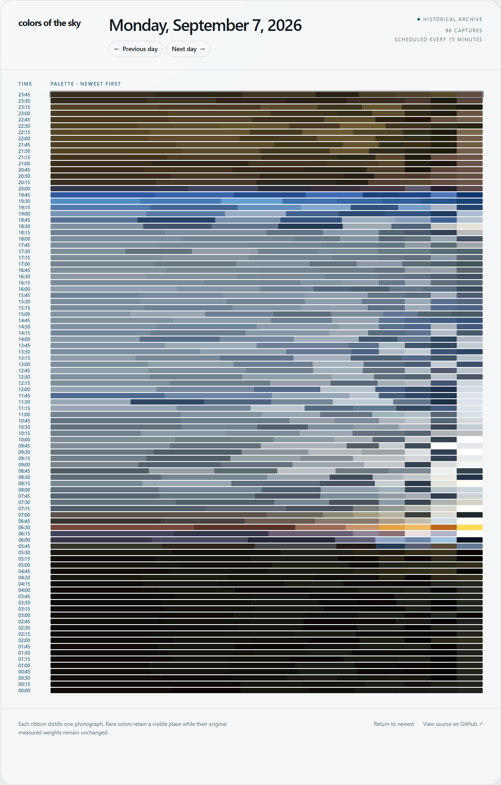
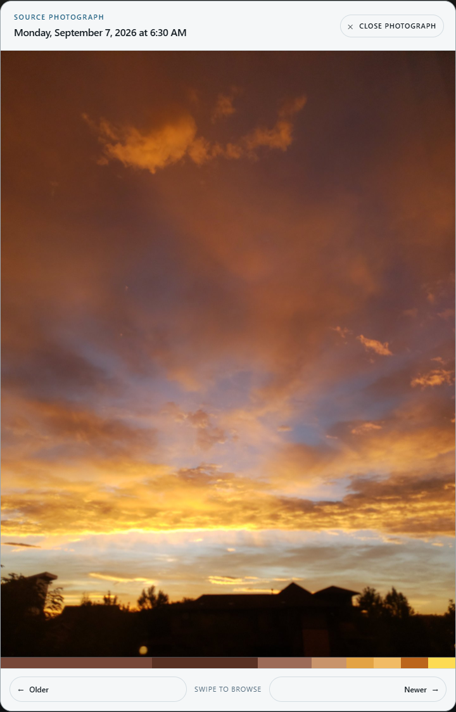

# Colors of the Sky

An old Android phone, a window, and a new way to watch the sky change.

Colors of the Sky turns regularly scheduled sky photographs into a daily
timeline of color palettes. A dedicated Android camera station captures the
view, excludes buildings and trees from palette analysis, and uploads the full
photograph with its extracted colors. The web archive shows each day's captures
newest first, from the subtle colors of night to the highlights of sunrise.

**[Explore the live archive](https://colors-sky-archive.jaredwinick.workers.dev)**
· [Set up the Android station](android-native/README.md)
· [Deploy to Cloudflare](docs/cloudflare-deployment.md)

<p>
  
  
</p>

*Actual web app screenshots from September 7, 2026: a complete day of palettes
and the photograph behind one sunrise palette.*

## Features

- One local calendar day per page, with 96 scheduled captures on a normal day
  at the default 15-minute interval. Only actual captures appear.
- Eight colors by default: five dominant colors plus three accents selected
  for perceptual distinction, helping small sunrise and sunset highlights survive.
- Full, uncropped photographs on hover/focus or in the image viewer, with a
  matching mini-palette. Use Older on the left and Newer on the right, swipe,
  or use the Left/Right Arrow keys to browse.
- Shareable day links, light and dark themes, keyboard navigation, and
  automatic current-day refresh without downloading every photograph up front.
- Native Android capture scheduling, adjustable sky masks, offline queueing,
  retry-safe uploads, and on-device diagnostics.

## Architecture

- **Website and API:** React with vinext, deployed as one Cloudflare Worker
- **Metadata:** D1 (`captures` table)
- **Photographs:** normalized, full-frame images in R2 (`SKY_IMAGES` binding)
- **Capture and processing:** native Kotlin/CameraX app in `android-native/`,
  developed and tested on a permanently mounted Samsung Galaxy S9+ running Android 10
- **Legacy client:** the Termux pipeline in `android/`, retained as a fallback

The phone normalizes each photograph and extracts its palette before uploading.
The mask affects only the sampled pixels; it does not crop or paint over the
uploaded image. The authenticated ingest endpoint stores the image in R2 and
its metadata and weighted palette in D1. The Worker does not extract palettes.

The website queries the selected calendar day in the configured timezone,
rather than a rolling 24-hour window. The current day refreshes every minute
while visible; historical days do not poll. Production shows an empty state
when a day has no captures. Only local development substitutes a designed sample
for an empty current day.

## Local development

Use Node.js **22.13.0 or newer** and pnpm. From the repository root:

```sh
pnpm install --frozen-lockfile
pnpm exec wrangler d1 migrations apply colors-production --local
pnpm dev
```

Open the local URL printed by the development server. Cloudflare tooling
simulates D1 and R2 locally; `--local` applies both committed migrations to the
local database, not production. The development sample contains palettes but
no source photographs, so image previews need real captures in local storage.

To test authenticated uploads locally, set a development-only `INGEST_TOKEN`
in an ignored `.env.local` file. Viewing the archive does not require that
token. Keep credentials out of commits.

Build and run the automated checks with:

```sh
pnpm test
```

This builds the production Worker and runs the API, archive, interaction-helper,
and client transfer-budget checks. To generate a migration after schema edits:

```sh
pnpm db:generate
```

Review the generated SQL and apply it locally before deploying a schema change.

## Hosted configuration

The deployment needs:

- D1 binding `DB`
- R2 binding `SKY_IMAGES`
- secret environment value `INGEST_TOKEN`
- plain-text environment value `DISPLAY_TIME_ZONE` containing an IANA zone
  (production currently uses `America/Denver`)

Generate a long random token, configure it only in the hosting environment and
on the phone, and never commit it. Apply both migrations in `drizzle/`: the
initial capture schema and indexes, followed by the image SHA-256 column used
for idempotent uploads.

For your own deployment, provision D1 and R2 resources and update the Worker
name, D1 database ID/name, R2 bucket name, and timezone in `wrangler.jsonc`.
The native release app uses a compiled ingest URL; change
`INGEST_ENDPOINT` in `android-native/app/build.gradle.kts` to your Worker's `/api/ingest` URL
before building your own release APK.

The production release procedure, original archive cutover record, and rollback
instructions are maintained in
[docs/cloudflare-deployment.md](docs/cloudflare-deployment.md). Use Wrangler's
deployment history to identify the current release and latest rollback point.

## Ingest contract

`POST /api/ingest` accepts `multipart/form-data` with:

- `capture_id`: client-generated UUIDv4, reused unchanged for every retry
- `image`: JPEG, PNG, or WebP, from 1 byte to 12 MiB (12,582,912 bytes)
- `captured_at`: ISO-8601 datetime
- `device_id`: optional source identifier; defaults to `android-sky-camera`
- `palette`: JSON array of 3–10 `{ "hex": "#RRGGBB", "weight": 0.25 }`

Send the token as `Authorization: Bearer …`. Palette weights must be positive
finite numbers; the API normalizes them and rounds to four decimal places.

The first accepted request returns `201`. An exact retry with the same ID,
image, timestamp, palette, and device returns the existing capture with `200`
and `idempotentReplay: true`. Reusing an ID for different content returns `409`.

See [android-native/README.md](android-native/README.md) for native phone setup,
mask calibration, palette configuration, APK builds, and signing requirements.
The older [Termux instructions](android/README.md) remain available separately.

## Archive read contract

`GET /api/captures?date=YYYY-MM-DD` returns the captures belonging to one
calendar day in `DISPLAY_TIME_ZONE`. If `date` is omitted, the endpoint uses
the current date in that configured zone. The Worker never derives the archive
zone from its own runtime or from a visitor's browser.

The response has this shape:

```json
{
  "date": "2026-08-16",
  "timeZone": "America/Denver",
  "captureCount": 1,
  "invalidCaptureCount": 0,
  "isCurrentDay": false,
  "captures": [
    {
      "id": "49dc2630-a965-40c6-9f39-261c22da4626",
      "capturedAt": "2026-08-17T05:45:00.000Z",
      "imageUrl": "/api/images/encoded-object-key",
      "palette": [
        { "hex": "#52739A", "weight": 0.5 },
        { "hex": "#8DA6BF", "weight": 0.3 },
        { "hex": "#E4B495", "weight": 0.2 }
      ]
    }
  ]
}
```

Captures are ordered newest first. Invalid dates return `400`. A record with
malformed palette JSON is omitted while `invalidCaptureCount` records the
problem, allowing the rest of the day to render. The R2 bucket is not directly
public, but source photographs are publicly readable through the same-origin
`/api/images/...` route; only uploads require authentication.

Local midnight boundaries are converted to UTC before querying D1. The query
uses the indexed half-open range `captured_at >= start AND captured_at < end`,
so daylight-saving days naturally span 23 or 25 hours. Current-day responses
have a 30-second shared cache lifetime with stale revalidation; completed days
have a one-day shared cache lifetime because their data changes infrequently.

The archive page keeps its selected day in a shareable `/day/YYYY-MM-DD` path.
A bare root request redirects to the current date in `DISPLAY_TIME_ZONE`;
invalid and future dates normalize to that same current-day URL. Previous-day
and next-day links use ordinary URLs, so direct links, reloads, and browser
back/forward navigation retain the selected day. The next-day control is
unavailable on the current day.

Only the current day polls for updates. Polling pauses while the page is hidden
and refreshes immediately when it becomes visible again. Missing scheduled
intervals are represented by the absence of a capture rather than placeholder
rows; the header reports the number of captures that actually exist and labels
15 minutes as the intended schedule.

Responsive, accessibility, and performance expectations are documented in
[docs/web-quality.md](docs/web-quality.md). The production test suite enforces
the client transfer budgets and the archive's key structural guarantees.
